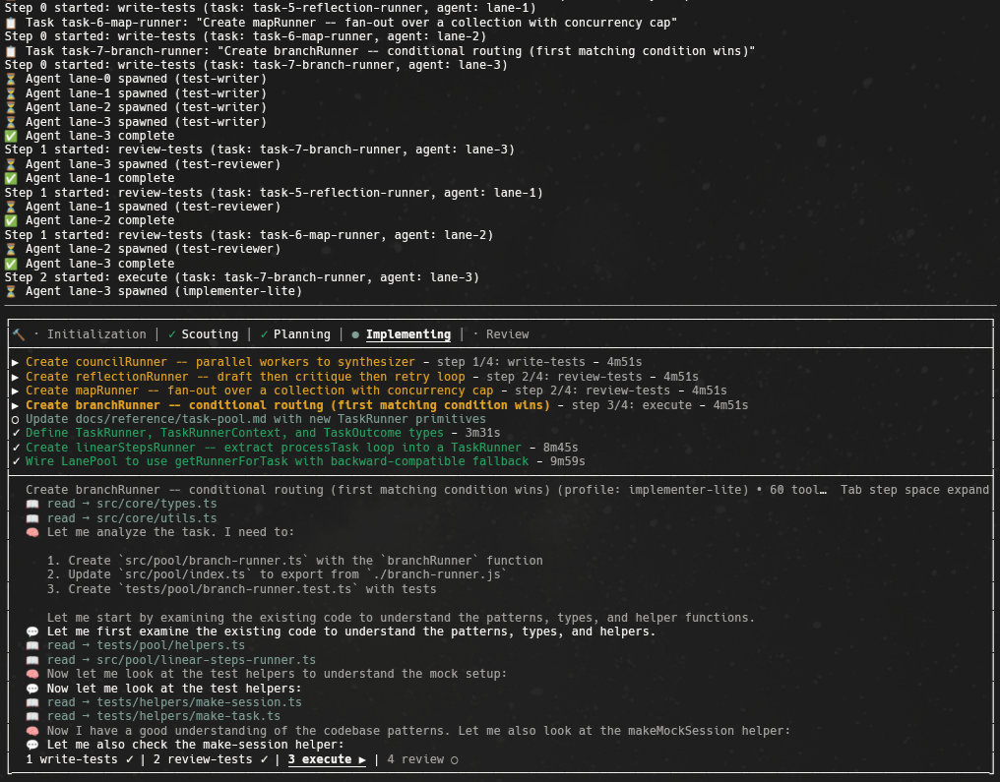

# @harms-haus/engin

> Short for "**Engin**eered **In**ference" — Eng. In. → engin.

[](https://github.com/harms-haus/engin/actions/workflows/ci.yml)



A script-based workflow engine for AI-driven development, built on top of
[pi-coding-agent](https://www.npmjs.com/package/@earendil-works/pi-coding-agent).

## Architecture

engin is a **client/server system**:

- A **long-lived server daemon** (`engin server up`, auto-started by `engin run`)
  hosts N concurrent workflow runs over a multi-run WebSocket protocol and serves
  the web UI. The server is the single execution path.
- The **CLI** (`engin <wf> <task>`) submits a run to the server and attaches a
  TUI (TTY) or stdout renderer (non-TTY) that consumes the run's event stream over
  WebSocket, blocking until the run finishes.
- The **web UI** (React) lists, views, and cancels active runs.

Internally, engin is a 5-package workspace: `shared` (pure types, the protocol, the
`evolve` reducer, `EngineClient`, `ClientStore`), `engine` (the server + execution),
`tui` (the terminal client), `cli` (the published `@harms-haus/engin` binary), and
`web` (the React client). See [Architecture](docs/concepts/architecture.md) for the
full layout and how status flows.

## Install

```bash
git clone <repository-url> engin
cd engin
bun install
bun run build
```

## Quick Start

```bash
# Create the config directory structure
engin init

# Add your own profiles and workflows to ~/.config/engin/
# See docs/README.md for profile and workflow authoring guides

# Start the server (optional — `engin run` auto-starts it if down)
engin server up

# Run a workflow (auto-starts the server, submits the run, attaches the TUI)
engin develop "Add input validation to all public API endpoints"
```

The server keeps running after the CLI exits, so you can re-attach with
`engin resume <runId>` and view runs in the web UI at `http://127.0.0.1:3619/`.

## Documentation

Full documentation is in [docs/README.md](docs/README.md), covering:

- Concepts (overview, client/server architecture)
- CLI reference (`run`, `resume`, `server up/down/status`, flags, detach/kill)
- Server reference (daemon, `RunManager`, the multi-run protocol, auth)
- Event store & status (the reducer, the projection, the `log` event)
- TUI and Web client references
- Configuration, programmatic API, and types references
- Workflow authoring and profiles guides

## License

All rights reserved.
